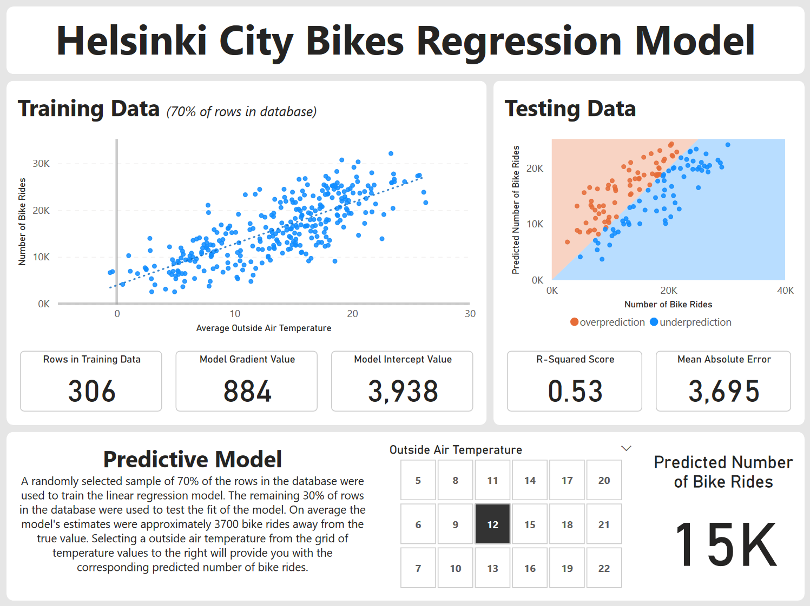

## Helsinki City Bike Linear Regression Model

Predictive linear regression model constructed in Power BI that uses the outside air temperature to predict the number of journeys taken on the Helsinki bike system, in the Helsinki and Espoo metropolitan areas of Finland.

## Features

- Applied Power Query Editor steps to aggregate the data from the source to reduce the size of the imported data model
- DAX Script to create two tables for the training data and testing data, using a 70/30 split
- Data Visualisations of the training and testing data
- Power BI What If parameter for user interaction with the final linear regression model

## Data Source

https://www.kaggle.com/datasets/geometrein/helsinki-city-bikes

## Dashboard Screenshot



## Code Extracts

### Power Query M formula language

```sql
let
    Source = Csv.Document(File.Contents("C:\Users\jonat\OneDrive\Code\Power BI - Helsinki City Bikes\data\database.csv"),[Delimiter=",", Columns=14, Encoding=65001, QuoteStyle=QuoteStyle.None]),
    #"Promoted Headers" = Table.PromoteHeaders(Source, [PromoteAllScalars=true]),
    #"Changed Type" = Table.TransformColumnTypes(#"Promoted Headers",{{"departure", type datetime}, {"return", type datetime}, {"departure_id", Int64.Type}, {"departure_name", type text}, {"return_id", Int64.Type}, {"return_name", type text}, {"distance (m)", type number}, {"duration (sec.)", Int64.Type}, {"avg_speed (km/h)", type number}, {"departure_latitude", type number}, {"departure_longitude", type number}, {"return_latitude", type number}, {"return_longitude", type number}, {"Air temperature (degC)", type number}}),
    #"Inserted Date" = Table.AddColumn(#"Changed Type", "Date", each DateTime.Date([departure]), type date),
    #"Reordered Columns" = Table.ReorderColumns(#"Inserted Date",{"Date", "departure", "return", "departure_id", "departure_name", "return_id", "return_name", "distance (m)", "duration (sec.)", "avg_speed (km/h)", "departure_latitude", "departure_longitude", "return_latitude", "return_longitude", "Air temperature (degC)"}),
    #"Grouped Rows" = Table.Group(#"Reordered Columns", {"Date"}, {{"Rides", each Table.RowCount(_), Int64.Type}, {"AvgAirTemp", each List.Average([#"Air temperature (degC)"]), type nullable number}}),
    #"Sorted Rows" = Table.Sort(#"Grouped Rows",{{"Date", Order.Descending}}),
    #"Filtered Rows" = Table.SelectRows(#"Sorted Rows", each [Date] > #date(2019, 1, 1))
in
    #"Filtered Rows"
```

### DAX Scripts

```
RandomNumber = 
// assign a random number to each row in order to randomly assign rows to the testing and training datasets
RAND()
```

```
TrainData = 
// Use 70% of the rows in the database as training Data
TOPN(COUNTROWS('Database')*0.7, 'Database', [RandomNumber], ASC)
```

```
Gradient = 
// calculate the gradient of the linear regression model
DIVIDE(COUNTROWS(TrainData) * SUMX(TrainData, TrainData[AvgAirTemp] * TrainData[Rides]) - SUMX(TrainData, TrainData[AvgAirTemp]) * SUMX(TrainData, TrainData[Rides]), COUNTROWS(TrainData) * SUMX('TrainData', TrainData[AvgAirTemp]^2) - SUMX(TrainData, TrainData[AvgAirTemp])^2, 0)
```

```
Intercept = 
// calculate the intercept value of the linear regression model
DIVIDE(SUMX(TrainData, TrainData[Rides]) * SUMX(TrainData, TrainData[AvgAirTemp]^2) - SUMX(TrainData, TrainData[AvgAirTemp]) * SUMX(TrainData, TrainData[AvgAirTemp] * TrainData[Rides]), COUNTROWS(TrainData) * SUMX(TrainData, TrainData[AvgAirTemp]^2) - SUMX(TrainData, TrainData[AvgAirTemp])^2, 0)
```

```
TestData = 
// Use 30% of the rows in the database as testing Data
TOPN(COUNTROWS('Database')*0.3, 'Database', [RandomNumber], DESC)
```

```
PredictedRides = 
// determine the model prediction number of rides for each row in the testing data
'TrainData'[Gradient] * [AvgAirTemp] + 'TrainData'[Intercept]
```

```
MeanAbsoluteError = 
// calculate the mean absolute error of the model
AVERAGEX('TestData', ABS([Rides] - [PredictedRides]))
```
